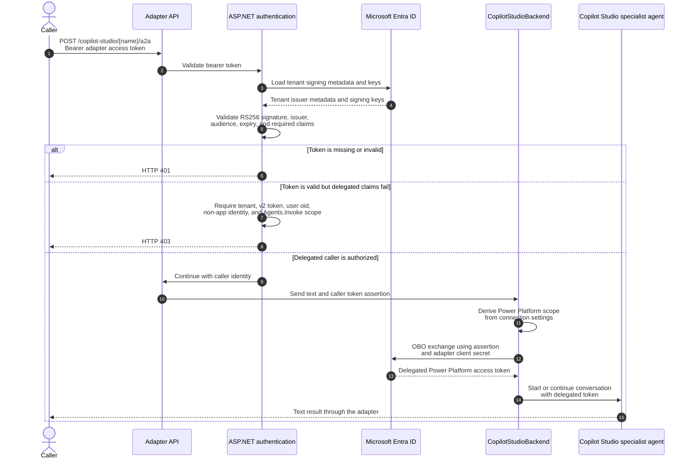
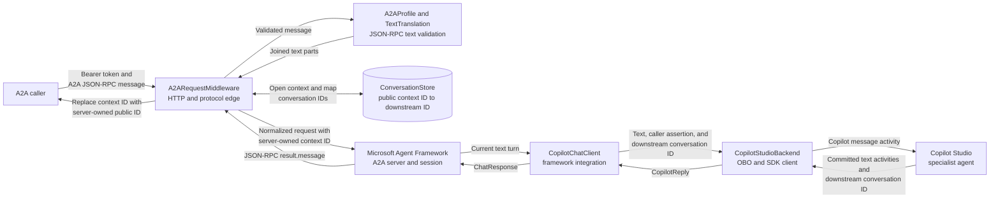
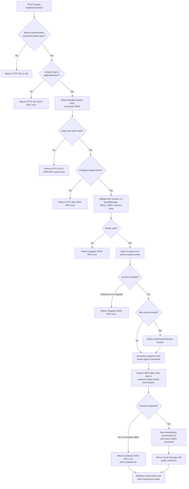

## Scope

The top-level solution provides a focused adapter that exposes configured Copilot
Studio specialist agents through the A2A 1.0 protocol. 

The request path is: authenticated caller -> Microsoft Agent Framework A2A server -> Copilot Studio specialist agent -> one text response. There is no model, orchestration layer, Foundry dependency, end-user UI, or client-credentials fallback.

## Architecture flows

### Authentication flow

The adapter uses two delegated tokens with different audiences. The caller's token is
validated for the adapter API, then used as the assertion in an OAuth 2.0 on-behalf-of
(OBO) exchange. The resulting Power Platform token is used only for the selected
Copilot Studio specialist agent.



The JWT checks and authorization policy are defined in
[src/CopilotStudioA2A/DelegatedAuthentication.cs](src/CopilotStudioA2A/DelegatedAuthentication.cs).
The OBO token is acquired for every turn, with no client-credentials fallback.

### Data flow

The public A2A context ID never exposes the downstream Copilot Studio conversation
ID. The in-memory conversation store maintains that mapping and Agent Framework
maintains its own session state.



[src/CopilotStudioA2A/TextTranslation.cs](src/CopilotStudioA2A/TextTranslation.cs)
contains the text-only translation boundary. Attachments, OAuth cards, error
activities, non-text parts, and missing final text are rejected rather than passed
through.

### Logic flow

The runtime accepts one synchronous `SendMessage` operation. Validation and context
management happen before Agent Framework can invoke the downstream backend.



The edge logic is implemented in
[src/CopilotStudioA2A/A2ARequestMiddleware.cs](src/CopilotStudioA2A/A2ARequestMiddleware.cs),
while [src/CopilotStudioA2A/ConversationStore.cs](src/CopilotStudioA2A/ConversationStore.cs)
serializes turns per context and evicts the least recently used idle context at
capacity.

## Before running

Install the .NET 10 LTS SDK. Dependencies are pinned in
[src/CopilotStudioA2A/CopilotStudioA2A.csproj](src/CopilotStudioA2A/CopilotStudioA2A.csproj).
A2A hosting packages are prerelease even though .NET 10 is LTS.

Publish the Copilot Studio specialist agent and copy its standard-harness
`DirectConnectUrl`. The adapter currently accepts public-cloud URLs under the
`environment.api.powerplatform.com` domain.

## Microsoft Entra setup

See [Microsoft Entra setup](docs/ENTRA-SETUP.md).

## Configuration and secrets

[src/CopilotStudioA2A/appsettings.json](src/CopilotStudioA2A/appsettings.json) defines the configuration structure but contains no credentials or agent URLs. Configure these keys through .NET user secrets in Development or App Service application settings/Key Vault references in Azure:

* `Authentication:TenantId`: directory GUID
* `Authentication:ClientId`: adapter API registration GUID
* `Authentication:Audience`: the same bare client ID, matching an Entra v2 access token's `aud`
* `Authentication:RequiredScope`: `Agents.Invoke`
* `Authentication:ClientSecret`: confidential application's secret, required for delegated OBO
* `Agents`: explicit list of enabled agent names, for example `CoolAgent`
* `CoolAgent:DirectConnectUrl`: secret connection URL for the `CoolAgent` route
* `CoolAgent:SkillDescription`: required agent-specific skill description, published in the public agent card
* `Adapter:PublicBaseUrl`: externally advertised HTTPS origin; defaults to HTTP loopback for local Development
* `Adapter:UseHardcodedBackend`: selects an offline backend that returns a fixed response without calling Copilot Studio; defaults to `false`
* `AllowedHosts`: allowed hostnames, semicolon-separated; defaults to localhost

For .NET user secrets, target [src/CopilotStudioA2A/CopilotStudioA2A.csproj](src/CopilotStudioA2A/CopilotStudioA2A.csproj). It already has a `UserSecretsId`. Use your editor's user-secrets management or the .NET user-secrets CLI locally. User secrets are outside source control but are not an encrypted vault.

In App Service settings or environment variables, replace configuration colons with double underscores, for example `CoolAgent__DirectConnectUrl` and `CoolAgent__SkillDescription`. In JSON use nested sections, not literal double-underscore property names. Do not use App Service's database connection-string category for these keys. Do not put secrets in tracked files, shell history, screenshots, or chat.

Configure the list and nonsecret descriptions in [src/CopilotStudioA2A/appsettings.json](src/CopilotStudioA2A/appsettings.json), then supply each agent's matching `DirectConnectUrl` through user secrets or App Service Key Vault references:

```json
{
  "Agents": ["CoolAgent"],
  "CoolAgent": {
    "SkillDescription": "Answers questions and helps users complete common tasks."
  }
}
```

For a single App Service application setting, set `Agents` to the JSON string value `["CoolAgent"]`. This adapter explicitly parses that value; it is not automatic array binding. The name must be quoted, so `[CoolAgent]` is not valid. Configure `CoolAgent__DirectConnectUrl` and `CoolAgent__SkillDescription` as separate settings.

Alternatively, use the indexed environment setting `Agents__0=CoolAgent`. A scalar JSON-valued `Agents` setting takes precedence over indexed entries and replaces the entire list. Indexed settings otherwise follow .NET's array-index merging rules; prefer the single JSON setting when removing or replacing an existing list.

Startup behavior:

* Every listed agent must have a nonblank `SkillDescription` in its own root section. Normal operation also requires a valid `DirectConnectUrl`. Missing settings or an invalid connection URL fail startup; errors name the required keys, never their values.
* A root section containing `DirectConnectUrl` or `SkillDescription` for an unlisted agent produces one startup warning. Its settings are ignored, even if incomplete or invalid. No endpoint, catalog entry or agent card is registered for it.
* Unrelated configuration sections do not produce agent warnings. An agent is identified by the list, not inferred from settings.
* Names preserve their configured casing, including `CoolAgent`. They must be unique case-insensitively, contain 1-63 ASCII letters, digits or hyphens, and start with a letter. Core section names `Agents`, `Adapter`, `Authentication`, `Logging`, `AllowedHosts`, and `CopilotStudio` are reserved.

Adding an agent requires adding its name to `Agents` and configuring its two settings. Removing its name disables it; remove its settings as well to avoid a warning. Restart after changes because the registry is captured at startup. The old `CopilotStudio:Agents:<name>:...` configuration is no longer used; migrate those settings to the root sections shown above.

Names and skill descriptions are public discovery information; never put secrets in them. Connection URLs remain secret. The current `Agents` list in [src/CopilotStudioA2A/appsettings.json](src/CopilotStudioA2A/appsettings.json) controls local discovery; an App Service `Agents` setting can replace that list for deployment.

## Testing

See [Testing](docs/TESTING.md) for the three supported paths and the hardcoded backend.

## A2A contract

This is a limited A2A 1.0 profile, not an implementation of every task-management operation.

* Runtime: `POST /copilot-studio/{name}/a2a`
* Per-agent card: `GET /copilot-studio/{name}/a2a/.well-known/agent-card.json` (application-specific discovery convention)
* Standard root card: `GET /.well-known/agent-card.json`, only when exactly one agent is configured
* Authenticated catalog: `GET /agents`, exposing names and public URLs only
* Anonymous health: `GET /health`

Cards are intentionally public and advertise bearer-token security, text/plain input/output, `JSONRPC`, and protocol version `1.0`. For multiple agents, configure the per-agent card URLs explicitly or use the authenticated catalog; the root cannot represent several independent cards.

Each card exposes one skill whose `id` and `name` match the agent route name. Its `skills[0].description` comes from that agent's configured `SkillDescription`, including on the single-agent root discovery route.

Every runtime call must have `Content-Type: application/json`, `Authorization: Bearer <API access token>` and `A2A-Version: 1.0`. The version header is the protocol's service parameter, not a custom JSON field. An absent version implies an older protocol, so it is rejected. The card's separate `version` value is the adapter release version, currently `1.0.0`.

Use JSON-RPC `jsonrpc: "2.0"`, a string/integer request `id`, and `method: "SendMessage"`. Under `params.message`, supply a nonempty `messageId`, `role: "ROLE_USER"`, and one or more `parts` containing `text`. Optional `mediaType` must be `text/plain`. Distinct parts are joined with a newline; their internal whitespace is preserved. The response is `result.message` with `ROLE_AGENT`, a generated message ID and context ID. It is never a task or SSE stream.

`configuration.acceptedOutputModes` may request text/plain (or a compatible wildcard). `returnImmediately` is accepted but has no effect for direct messages. Task history, push notifications, extensions, caller metadata and non-text payloads are not forwarded. Unknown methods, streaming, tasks, batches, notifications, ambiguous parts and duplicate JSON properties are explicitly rejected.

Protocol errors preserve the JSON-RPC request ID where possible. Invalid version is `-32009`; unsupported operations are `-32004`; push configuration is `-32003`; unsupported content is `-32005`; unknown methods are `-32601`; malformed parameters are `-32602`. Unknown agent runtime calls return HTTP 404 with a JSON-RPC error. Invalid HTTP media and oversized requests return HTTP 415 and 413. Other profile errors use a JSON-RPC error response with HTTP 200.

## Translation and conversation state

Inspect [src/CopilotStudioA2A/TextTranslation.cs](src/CopilotStudioA2A/TextTranslation.cs) for the explicit translation boundary. It maps A2A parts to one Copilot message activity and committed Copilot message activities to an Agent Framework response. Typing/progress/deltas are ignored; a final message is collected once. Attachments, OAuth sign-in cards, error activities and missing final text produce explicit errors instead of empty success responses. Startup greetings are not returned as the answer to the user's question.

[src/CopilotStudioA2A/CopilotStudioBackend.cs](src/CopilotStudioA2A/CopilotStudioBackend.cs) is the SDK feed-through. The SDK derives the OAuth scope from the connection settings; its token callback's URL is never used as a scope. Every turn obtains a delegated token using the current caller's assertion. The backend sends only the current message because Copilot Studio maintains conversation history.

[src/CopilotStudioA2A/A2ARequestMiddleware.cs](src/CopilotStudioA2A/A2ARequestMiddleware.cs) enforces the limited contract around the Agent Framework JSON-RPC endpoint. It provides a server-generated, per-agent A2A context and preserves that public identifier in responses. [src/CopilotStudioA2A/ConversationStore.cs](src/CopilotStudioA2A/ConversationStore.cs) maps it to the actual Copilot Studio conversation ID. Framework session state is also in memory. Context IDs are opaque; clients must not send downstream conversation IDs directly.

Each context supports multiple turns. Turns execute sequentially so that downstream
conversation state remains ordered; an overlapping request waits for earlier turns in
the same context instead of being rejected. The request deadline includes queue time.
The default maximum is 1,000 contexts across the process. At capacity, the least
recently used idle context and its framework session are evicted. If all contexts have
active or queued turns, a new context is rejected. A missing, evicted, cross-agent or
pre-restart context is rejected rather than silently restarted. Omit `contextId` to
explicitly start a new conversation.

> [!WARNING]
> Context ownership is deliberately not checked. Any authorized caller who knows another caller's context ID can attempt to continue that conversation. Protect context IDs and do not expose this deployment to mutually untrusted users until owner binding is implemented. All context state is lost on restart, slot swap or instance replacement. Run one App Service instance only; there is no shared persistence.

The default request deadline is 120 seconds, configurable up to 180 seconds to remain below App Service's request limits. Client cancellation propagates downstream. No message is automatically retried and a failed conversation is not automatically restarted. A canceled/failed request may already have executed downstream actions. Message IDs are required for the contract, but this minimal adapter does not provide durable deduplication or exactly-once execution; do not automatically replay uncertain results.

## Azure App Service

[infra/main.bicep](infra/main.bicep) prepares one Linux .NET 10 App Service instance, its plan, a managed identity, Key Vault with secret references, Log Analytics and Application Insights. [infra/main.bicepparam](infra/main.bicepparam) is the parameter example. Deployment and identity consent are not performed automatically.

Provide an existing Entra app registration, its confidential client secret, and a JSON object mapping agent route names to connection URLs through your secure deployment environment. The template's secure parameters prevent ordinary ARM outputs from exposing these values. Generated parameter files can still contain resolved secrets; do not save or log them.

Supply `agentNames` as the explicit enabled-agent list. The template serializes it into the single App Service `Agents` setting. The independent `agentDirectConnectUrls` and `agentSkillDescriptions` dictionaries emit `<name>__DirectConnectUrl` and `<name>__SkillDescription` settings. Descriptions are not stored in Key Vault because they appear in anonymous agent cards.

The template does not infer enabled agents from these dictionaries or filter out unlisted settings. The runtime fails startup if a listed name is missing required settings, and warns about unused agent settings. The parameter example includes `CoolAgent`; adjust the list and both dictionaries for your deployment.

Publish the web project in Release configuration and deploy the ZIP of the publish directory's **contents**, not its parent folder. App Service runs `dotnet CopilotStudioA2A.dll`. Basic publishing credentials and FTP are disabled; use an Entra-authenticated deployment mechanism. The optional [Dockerfile](Dockerfile) provides a separate non-root container packaging path; the Bicep template uses the built-in .NET runtime, not that container.

Key Vault references use the application's managed identity and the Key Vault Secrets User role. OBO still uses the confidential app secret; managed identity is not substituted for the incoming user's identity. Allow time for RBAC propagation and Key Vault reference refresh. The minimal template uses a public Key Vault endpoint protected by RBAC; private networking, availability zones and durable session storage are later deployment hardening decisions.

## Logging and diagnostics

Application Insights is enabled when `APPLICATIONINSIGHTS_CONNECTION_STRING` is configured. The application uses the Azure Monitor OpenTelemetry distro; do not also enable the App Service automatic-instrumentation extension. Request telemetry and content-free `copilot_studio.invoke` spans correlate failures with `X-Correlation-ID`.

SDK and HTTP-client logging are suppressed to avoid recording secret connection URLs and message content. Raw HTTP dependency instrumentation is filtered for the same reason. Exceptions are logged with a sanitized exception, original stack location, exception type and safe HTTP/MSAL codes, not SDK messages, response bodies, bearer tokens or secrets. Do not enable sensitive-data capture in production.

For HTTP 401/403, verify audience, issuer, token version and delegated scope. For OBO errors, verify the confidential client's secret, delegated Power Platform permission and consent. For invalid agent responses, verify publication and text-only agent behavior. Delegated transport authentication does not implement an agent's separate interactive OAuth-card/connector sign-in flow; configure that flow before use or extend the adapter deliberately rather than forwarding arbitrary tokens to card-specified resources.

## References

* [A2A 1.0 specification](https://a2a-protocol.org/latest/specification/)
* [Agent Framework A2A hosting](https://learn.microsoft.com/agent-framework/hosting/self-hosting/a2a/dotnet)
* [Azure Monitor OpenTelemetry](https://learn.microsoft.com/azure/azure-monitor/app/opentelemetry-enable)